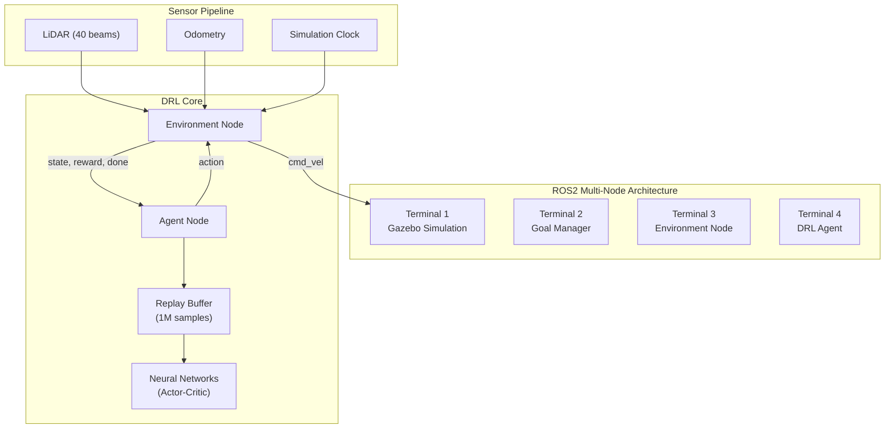
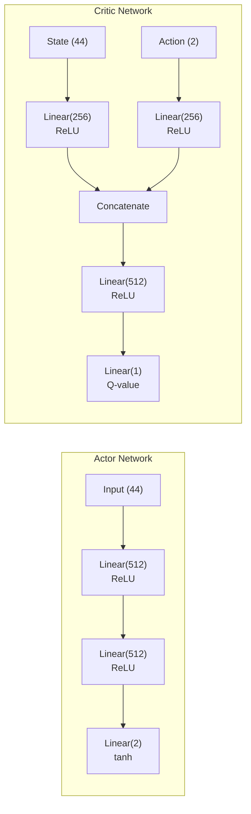
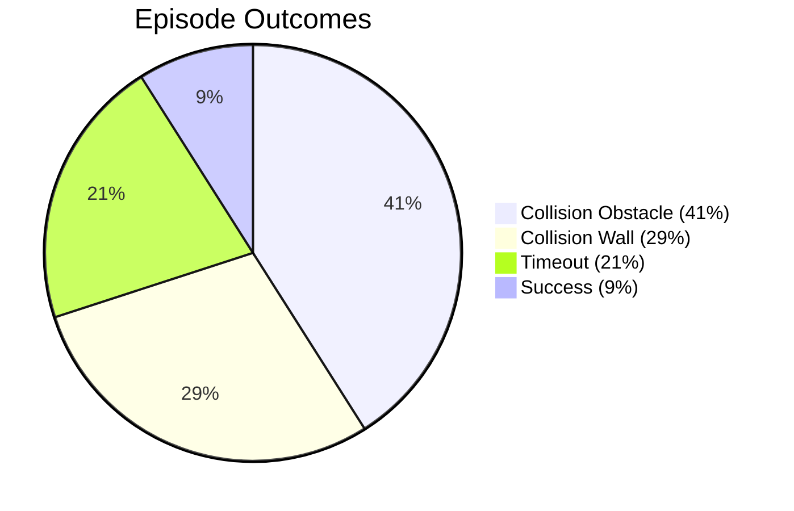

# 7th Semester BTP — Deep Reinforcement Learning for Autonomous Robot Navigation

**Project:** TurtleBot3 DRL Navigation  
**Machine:** GPREDDY  
**Environment:** Stage 4 (static + dynamic obstacles)  
**Training Period:** Aug 27, 2026 – Sep 6, 2026  

---

## 1. Abstract

This project implements a ROS2 + PyTorch framework for training Deep Reinforcement Learning agents to perform autonomous navigation and obstacle avoidance on the TurtleBot3 mobile robot. The robot uses 40-beam LiDAR as its primary sensor and learns to navigate to goal positions in simulation (Gazebo). Four DRL algorithms are implemented and compared: **DQN, DDPG, TD3, and SAC**. Models are trained in simulation with sim-to-real transfer capability.

---

## 2. System Architecture



### Node Communication

| Service | Direction | Purpose |
|---------|-----------|---------|
| `step_comm` | Agent → Environment | Send action, receive next state + reward |
| `goal_comm` | Agent → Environment | Check if new goal is available |
| `task_succeed` / `task_fail` | Environment → Goal Manager | Trigger goal respawn + simulation reset |
| `pause_physics` / `unpause_physics` | Agent → Gazebo | Control simulation timing |

---

## 3. State & Action Design

### State Vector (44 dimensions)

```
┌─────────────────────────────────────────────────────────────────────────────┐
│  40 LiDAR scans (normalized 0–1)  │ goal_dist │ goal_angle │ v_lin │ v_ang │
│         s[0..39]                   │  s[40]    │   s[41]    │ s[42] │ s[43] │
└─────────────────────────────────────────────────────────────────────────────┘
```

| Component | Range | Description |
|-----------|-------|-------------|
| LiDAR scans × 40 | [0, 1] | Distance to obstacles, normalized by 3.5m cap |
| Goal distance | [0, 1] | Euclidean distance to goal, normalized by arena diagonal |
| Goal angle | [-1, 1] | Heading error to goal, normalized by π |
| Previous linear velocity | [-1, 1] | Last commanded forward speed |
| Previous angular velocity | [-1, 1] | Last commanded turn rate |

### Action Space

| Algorithm | Type | Actions |
|-----------|------|---------|
| DQN | Discrete (5) | `[0.3, -1.0], [0.3, -0.5], [1.0, 0.0], [0.3, 0.5], [0.3, 1.0]` |
| DDPG/TD3/SAC | Continuous (2) | `[linear_vel, angular_vel]` ∈ [-1, 1] → mapped to [0, 0.22] m/s, [-2, 2] rad/s |

---

## 4. Reward Engineering

### Reward Function "A" (Default)

```python
reward = r_yaw + r_distance + r_obstacle + r_vlinear + r_vangular - 1
```

| Component | Formula | Range | Purpose |
|-----------|---------|-------|---------|
| `r_yaw` | `-abs(goal_angle)` | [-π, 0] | Face the goal |
| `r_distance` | `2 × d₀/(d₀ + d) - 1` | [-1, 1] | Get closer to goal |
| `r_vlinear` | `-(0.22 - v_lin)² × 100` | [-4.84, 0] | Move at max speed |
| `r_vangular` | `-ω²` | [-4, 0] | Minimize turning |
| `r_obstacle` | `-20 if min_dist < 0.22` | {-20, 0} | Avoid obstacles |
| Constant | `-1` per step | -1 | Time penalty |

**Terminal Rewards:**
- **SUCCESS:** +2500
- **COLLISION:** -2000

---

## 5. Algorithm Implementations

### 5.1 Network Architecture (Common Pattern)



### 5.2 Algorithm Comparison

| Feature | DQN | DDPG | TD3 | SAC |
|---------|-----|------|-----|-----|
| Action space | Discrete (5) | Continuous (2) | Continuous (2) | Continuous (2) |
| Critics | — | 1 | 2 (twin) | 2 (twin) |
| Target networks | Actor only | Actor + Critic | Actor + Critic | Critic only |
| Exploration | ε-greedy | OU Noise | OU Noise + Policy Noise | Entropy-based |
| Policy update | Every step | Every step | Every 2 steps | Every step |
| Entropy tuning | — | — | — | Automatic (α) |
| Target update | Hard (every 1000) | Soft (τ=0.003) | Soft (τ=0.003) | Soft (τ=0.003) |

### 5.3 Shared Hyperparameters

| Parameter | Value |
|-----------|-------|
| Hidden size | 512 |
| Batch size | 128 |
| Replay buffer | 1,000,000 |
| Discount factor (γ) | 0.99 |
| Learning rate | 0.003 |
| Soft update (τ) | 0.003 |
| Optimizer | AdamW |
| Loss function | Smooth L1 (Huber) |
| Gradient clip | max_norm=2.0 |
| Observe steps | 25,000 (random actions) |
| Weight init | Xavier uniform + 0.01 bias |

---

## 6. Training Results

### 6.1 Models Trained

| Algorithm | Runs | Stage | Significant Training |
|-----------|------|-------|---------------------|
| **DDPG** | 8 runs (`ddpg_0` to `ddpg_7`) | Stage 4 | All appear to be initial/aborted runs (no episode data beyond observe phase) |
| **TD3** | 1 run (`td3_0`) | Stage 4 | Initial run only, no trained episodes |
| **SAC** | 5 runs (`sac_0` to `sac_4`) | Stage 4 | **`sac_4_stage_4` is the primary trained model** |

> [!IMPORTANT]
> The only model with substantial training is **SAC (`sac_4_stage_4`)** with **3,804 episodes** and **~3.4M total environment steps**, trained from Aug 27 to Sep 2, 2026.

### 6.2 SAC Training Results (sac_4_stage_4)

#### Reward Curve


#### Episode Outcome Distribution (3,804 episodes)



| Outcome | Count | Percentage |
|---------|-------|------------|
| **Collision (Dynamic Obstacle)** | ~1,560 | **41.0%** |
| **Collision (Wall)** | ~1,115 | **29.3%** |
| **Timeout** | ~800 | **20.5%** |
| **Success** | ~350 | **~9.2%** |
| Tumble | 0 | 0% |

#### Key Performance Metrics

| Metric | Value |
|--------|-------|
| Total episodes | 3,804 |
| Total environment steps | ~3,414,000 |
| Overall success rate | **~9.2%** |
| Last 100 episodes success rate | **~10%** |
| Average reward (all) | **-4,526** |
| Best episode reward | **+2,489** (successful navigation) |
| Worst episode reward | ~-10,000 |
| Replay buffer | Full (1M samples) |
| Training duration | ~6 days |

#### Training Progression

| Episode Range | Avg Reward | Success Rate | Observation |
|---------------|------------|-------------|-------------|
| 1–500 | ~-5,500 | ~2% | Initial exploration, mostly collisions |
| 500–1,000 | ~-4,800 | ~4% | Slight improvement in obstacle detection |
| 1,000–2,000 | ~-4,500 | ~6% | Learning to avoid walls, still poor with dynamic obstacles |
| 2,000–3,000 | ~-4,200 | ~8% | Occasional successes, reward curve noisy |
| 3,000–3,800 | ~-4,000 | ~10% | Marginal improvement, plateauing |

> [!WARNING]
> The agent is **not converging well**. After 3,800 episodes the success rate is still only ~10%, with 70% of episodes ending in collision. The reward curve (bottom-right plot) shows **high variance and no clear upward trend** after episode ~500.

---

## 7. Observations from Training Curves

### Outcomes Plot (Top-Left)
- **Cyan (Collision Dynamic)** dominates and grows linearly → the agent has not learned to handle moving obstacles
- **Red (Collision Wall)** is the second most common → basic obstacle avoidance is weak
- **Green (Success)** grows slowly but is far behind the collision counts
- **Purple (Timeout)** is significant → agent sometimes wanders without reaching the goal

### Critic Loss (Top-Right)
- Starts high (~55), drops sharply to ~25-30 by episode 500
- Remains **stable around 25-30** from episode 500 onwards
- The stability suggests the critic is fitting well but may be **learning a pessimistic value function**

### Actor Loss (Bottom-Left)
- Spike to ~800 early in training, then stabilizes around **400-440**
- A sharp dip to ~0 around episode 1200 (likely a training restart artifact)
- **Actor loss is high and plateaued** — the actor is struggling to improve its policy

### Reward Curve (Bottom-Right)
- Oscillates wildly between **-7000 and -1000** with occasional positive spikes (successes)
- **No sustained upward trend** — characteristic of a struggling agent
- The positive spikes (+2500) correspond to successful navigations

---

## 8. Analysis: Why Training Is Struggling

### 8.1 Stage 4 Difficulty
Stage 4 includes **dynamic (moving) obstacles** which significantly increase task difficulty. The agent needs to predict obstacle trajectories, which is challenging with single-frame LiDAR.

### 8.2 Potential Issues

| Issue | Evidence | Suggested Fix |
|-------|----------|---------------|
| **Learning rate too high** | Actor loss plateaued at ~400, noisy rewards | Reduce LR from 0.003 to 0.001 or use LR scheduling |
| **No frame stacking** | `ENABLE_STACKING = False` — agent can't perceive obstacle velocity | Enable with `STACK_DEPTH=3`, `FRAME_SKIP=4` |
| **Reward scale mismatch** | Terminal rewards (±2000/2500) vs per-step (-1 to -30) — 100x difference | Scale down terminal rewards or normalize rewards |
| **Observe phase short** | 25,000 steps (25K) before training starts | Consider increasing to 50K–100K for better initial buffer diversity |
| **Stage too hard for early training** | Stage 4 has moving obstacles immediately | Start on Stage 1-2 (static obstacles), then fine-tune on Stage 4 |
| **Batch size** | 128 may be too small for 44-dim state space | Try 256 or 512 |

---

## 9. Codebase Quality Assessment

### Strengths
- **Clean modular architecture**: Agent, Environment, Gazebo, Common modules are well-separated
- **Extensible design**: Adding a new algorithm = subclass `OffPolicyAgent` + implement 3 methods
- **4 algorithm implementations**: DQN, DDPG, TD3, SAC with shared infrastructure
- **Sim-to-real pipeline**: Configurable for physical robot deployment
- **Docker support**: Reproducible environment with CUDA + Gazebo + ROS2

### Code Metrics

| Metric | Value |
|--------|-------|
| Total Python source files | ~18 |
| Total lines of code | ~2,200 |
| DRL algorithms implemented | 4 (DQN, DDPG, TD3, SAC) |
| Simulation environments | 10 stages |
| Neural network parameters | ~550K (actor), ~800K (critic) |

### Bugs Found

| # | Severity | Bug | Location |
|---|----------|-----|----------|
| 1 | 🔴 High | `StorageManager.delete_file` missing `@staticmethod` — crashes on model cleanup | `storagemanager.py:36` |
| 2 | 🟡 Medium | `main_real` passes `'0'` (truthy) instead of `1` for `real_robot` | `drl_agent.py:217` |
| 3 | 🟡 Medium | `REWARD_FUNCTION` defined twice — silently overridden | `settings.py:20,69` |
| 4 | 🟡 Medium | Import shadow: `queue.Empty` overwritten by `std_srvs.srv.Empty` | `utilities.py:1-4` |
| 5 | 🟢 Low | Typo: `THREHSOLD_GOAL` should be `THRESHOLD_GOAL` | `settings.py:35` |
| 6 | 🟢 Low | Duplicate `EPISODE_TIMEOUT_SECONDS` | `settings.py:21,27` |

---

## 10. Recommendations & Future Work

### Immediate (to improve current results)
1. **Enable frame stacking** — critical for detecting obstacle motion direction
2. **Curriculum learning** — train on Stage 1/2 first, transfer to Stage 4
3. **Lower learning rate** to 0.001 with cosine decay schedule
4. **Normalize rewards** — rescale terminal rewards closer to per-step magnitudes

### Medium-term
5. **Implement Prioritized Experience Replay** — focus training on rare success/failure transitions
6. **Try DDPG/TD3 with proper training** — currently only SAC has been fully trained
7. **Add reward function "B"** — experiment with distance-based potential shaping

### Long-term
8. **Deploy best model to physical robot** — validate sim-to-real transfer
9. **Benchmark across all 10 stages** — systematic comparison of algorithm performance
10. **Add curriculum stage progression** — automatically advance to harder stages

---

## 11. Tech Stack

| Component | Version |
|-----------|---------|
| OS | Ubuntu 20.04 (Docker) |
| ROS2 | Foxy Fitzroy |
| Simulator | Gazebo 11 |
| ML Framework | PyTorch 1.10 + CUDA 11.3 |
| Python | 3.8 |
| Robot | TurtleBot3 Burger |
| LiDAR | 40-beam, 3.5m range |
| GPU | CUDA-enabled (hostname: GPREDDY) |
